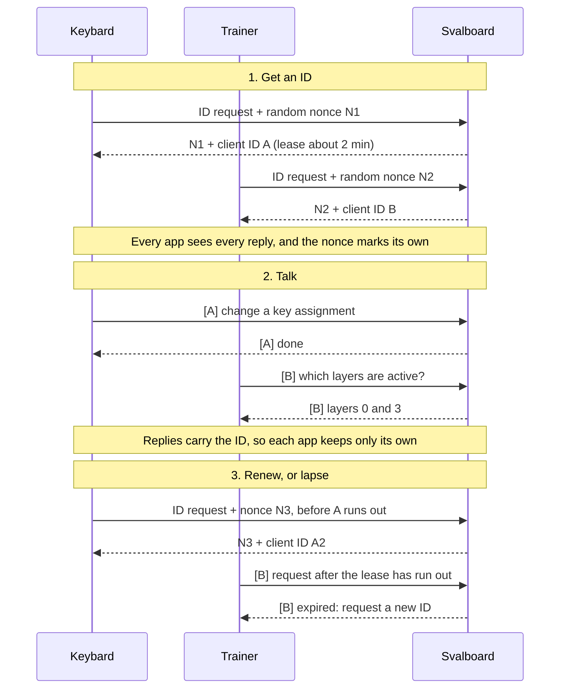

# A keyboard your apps can talk to

[Keybard feature guide](https://github.com/svalboard/keybard/blob/main/docs/launch/README.md) · [Firmware additions](firmware-changes.md)

Sval QMK gives desktop applications a two-way connection to your Svalboard. An app can read the layout stored on the keyboard, follow its active layers, inspect physical key activity, and send configuration or layer changes back. This is what makes Keybard possible—and it provides the foundation for tools that help you learn your layout or adapt it to the application you are using.

The keyboard still runs your saved layout itself. Host applications add editing, visual feedback, and context while they are connected; ordinary typing does not depend on keeping Keybard open.

## What travels in each direction

Normal key presses and pointer movement reach your computer through the usual USB keyboard and mouse interfaces. Alongside those, Sval provides a **Raw HID connection** for applications. Keybard uses that connection through the browser’s WebHID support; native companions can use a desktop HID library.

| From the keyboard to an app | What it enables |
| --- | --- |
| Board definition, matrix geometry, and selected cluster configuration | Draw the connected Svalboard with the appropriate physical positions. |
| Key assignments across all layers | Display or back up your actual layout directly from the board. |
| Programmable behaviors, including tap-dance actions | Show what a configured key can do and edit its actions. |
| Active- and default-layer state | Update a layout display as you hold or switch layers, including when you change your base layout. |
| Physical switch-matrix state | Highlight held keys for troubleshooting or a learning aid. |
| Feature capacities, settings, and hardware information | Load the board’s configuration and present its controls. |

| From an app to the keyboard | What it enables |
| --- | --- |
| Keymap and programmable-behavior changes | Edit assignments, shortcuts, and macros without compiling firmware. |
| Pointing and other supported hardware settings | Adjust the keyboard through Keybard. |
| Active-layer changes | Select an existing layer immediately, without rewriting its assignments. |
| Diagnostic requests | Ask for matrix state or use advanced scan diagnostics when needed. |

Configuration edits and live layer selection serve different purposes. Changing a key assignment updates the stored layout. Selecting an active layer changes runtime state: switching layers does not save another copy of the layout or cause a flash write for each application switch.

The current connection uses **requests and replies**. An app asks for state and receives a snapshot. Live displays poll for fresh snapshots; this release does not provide a continuous push stream of every key press and release. Matrix snapshots are useful for highlighting held keys, but a very brief tap can fall between polls.

## More than one app can participate

A layout editor and a trainer need different things from the same keyboard. Keybard changes assignments; a trainer reads those assignments and follows layer changes. Sval’s **client-ID wrapper** gives cooperating applications a way to distinguish their conversations.

### How apps get and keep an identity

Every message is a 32-byte Raw HID report in the same envelope:

| `0xDD` | client ID (4 bytes) | inner protocol: `0xDF` Sval or `0xFE` VIA | payload |
| --- | --- | --- | --- |

An app first asks for an ID, sending a random 20-byte nonce with ID `0`. The keyboard echoes the nonce with a fresh ID and its lease. The app then sends every request with that ID, and the keyboard returns the ID in the reply, so apps sharing the keyboard never mistake another app's reply for their own. Before the lease runs out, the app simply asks for a new ID.

The keyboard keeps no list of connected apps. Each ID carries the time it was issued, plus a counter that keeps it unique, so checking a request is just checking the ID's age. Nothing has to be cleaned up when an app crashes or is closed: its ID quietly expires. Because it stores nothing per app, the keyboard can serve any number of cooperating apps.

Actual simultaneous access also depends on the operating system and the applications' HID implementations.

Client IDs route replies; they do not reserve settings or resolve competing edits. Two apps writing the same assignment can still overwrite each other. The useful arrangement is one editor, with other tools observing state or controlling an agreed part of runtime behavior. A trainer should reload its layout after you edit it: this release has no layout-change notification to refresh another app’s cached copy automatically.

## Trainer and the desktop overlay

Trainer uses this connection to put a reference to **your own layout** beside your work. Instead of consulting a static diagram, you can see the bindings for the layer you are using. Holding a navigation layer can reveal navigation keys; switching to symbols can reveal the corresponding symbols. Transparent positions resolve through the lower layers so the reference remains useful across a layered layout.

The trainer reads the board’s layout and cluster selections, follows active-layer changes, and offers optional held-key highlighting through matrix snapshots. That is the foundation of the key-peek experience: glance at the keyboard overlay when you need a reminder, then keep working. Reading those definitions and states does not require capturing the text you type into other applications.

An overlay can describe configured tap and hold actions, but displaying a binding is different from observing which action the firmware ultimately executes. Richer feedback for resolved tap dances, combos, and other timed behaviors is a further step. Automatic default-layer reporting lets the trainer follow base-layout changes as well as momentary layers. Older firmware without the advertised capability still requires a manual default-layer choice.

The Windows Keybard Host preview is available separately from the firmware download. Configure it in Keybard’s Trainer panel; see the [launch notes](https://github.com/svalboard/keybard/blob/main/docs/launch/launch.md#learn-your-layout-with-trainer) for installation and platform limits.

## Layer state from the host

Host apps can read the keyboard’s active and default layer state and control which layer is active.

## Under the hood

The release uses **Sval protocol version 3**, carried in 32-byte Raw HID reports. A client-ID envelope carries either familiar VIA operations, such as keymap reads and writes, or Sval-specific operations for programmable behaviors, board definitions, and live state.

| Protocol capability | Practical benefit |
| --- | --- |
| Board-provided compressed definition | Applications can load the keyboard’s geometry and configuration information directly. |
| 16-bit behavior indices | Address all 256 entries in each supported behavior table. |
| Version 3 sparse table reads | Retrieve populated behaviors without downloading every empty slot. |
| Version 3 macro transfers with 32-bit offsets | Access macro storage beyond the older 64 KiB addressing boundary. |
| 32-bit active- and default-layer masks | Describe all active layers and base layers together, so a companion can follow changes to either. Hosts check the advertised capability before reading default-layer data. |
| Client IDs echoed in replies | Keep cooperating applications’ request/reply conversations distinguishable. |

App authors should serialize requests within each connection, check reply identity and command, renew client IDs, and recover cleanly from disconnects. Feature capabilities distinguish extensions that share a protocol version. A read-only companion can restrict itself to reads; an editor or layer controller can add only the writes its purpose requires.

For packet formats and implementation details, see the [client-ID protocol reference](../../../modules/svalboard/core/docs/CLIENT_ID_PROTOCOL.md), [Sval command definitions](../../../modules/svalboard/core/sval.h), [active/default-layer reporting](../../../modules/svalboard/core/docs/LAYER_STATE_PROTOCOL.md), and [command handlers](../../../modules/svalboard/core/sval.c).
